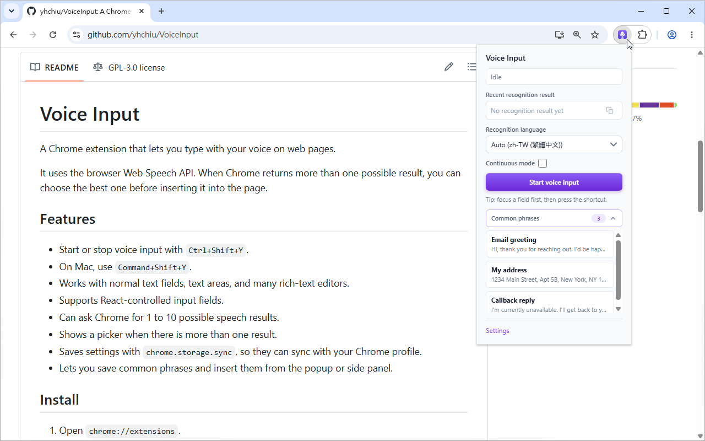
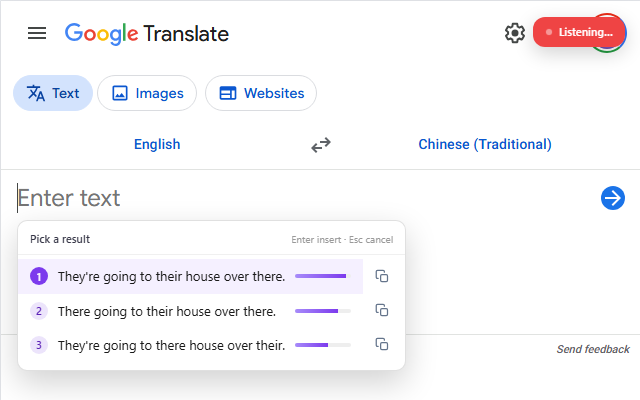
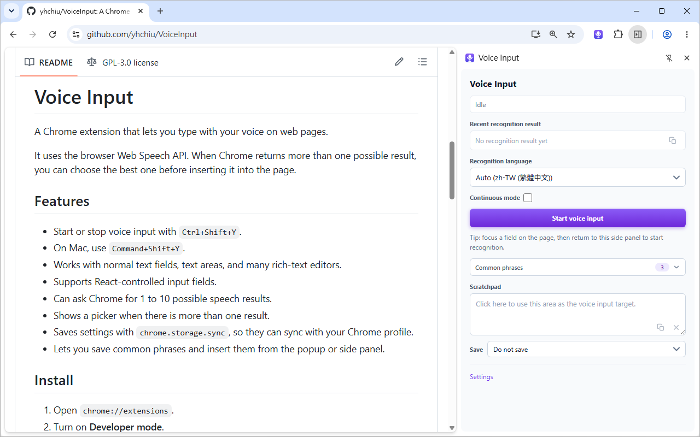
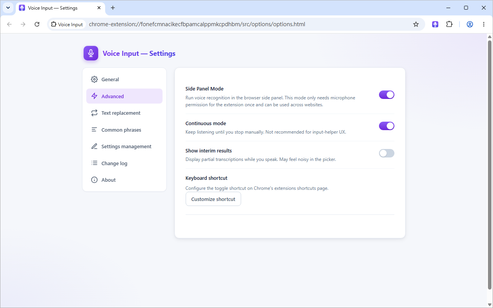
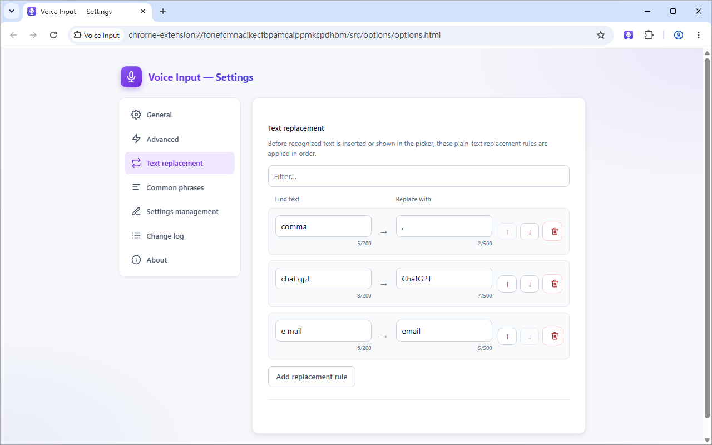

# Voice Input

A Chrome extension that lets you type with your voice on web pages.

It uses the browser Web Speech API. When Chrome returns more than one possible result, you can choose the best one before inserting it into the page.

[Available in the Chrome Web Store](https://chromewebstore.google.com/detail/voice-input/bbdknbnjnfiobplkijiklbdndemlohca)

## Features

- Start or stop voice input with `Ctrl+Shift+Y`.
- On Mac, use `Command+Shift+Y`.
- Works with normal text fields, text areas, and many rich-text editors.
- Supports React-controlled input fields.
- Can ask Chrome for 1 to 10 possible speech results.
- Shows a picker when there is more than one result.
- Saves settings with `chrome.storage.sync`, so they can sync with your Chrome profile.
- Lets you save common phrases and insert them from the popup or side panel.

## Screenshots

### Extension Popup with Common Phrases



### Picker with Possible Speech Results



### Extension Side Panel



### Extension Settings



### Text Replacement for Speech Results



## Install

### From Chrome Web Store (Recommended)

Install directly from the Chrome Web Store: [Voice Input](https://chromewebstore.google.com/detail/voice-input/bbdknbnjnfiobplkijiklbdndemlohca)

1. Visit the Chrome Web Store link above
2. Click "Add to Chrome" button
3. Confirm the installation when prompted

### From Source

1. Open `chrome://extensions`.
2. Turn on **Developer mode**.
3. Click **Load unpacked**.
4. Select this project folder.

## Testing

Tests use Node's built-in test runner and do not require third-party dependencies.

Run all tests:

```sh
npm test
```

If `npm` is not available, run the same test suite directly with Node:

```sh
node --test 'test/*.test.js'
```

The tests load the extension's classic scripts in isolated VM contexts and use lightweight fakes for Chrome APIs and DOM behavior.

## How To Use

1. Click a text field on any web page.
2. Press `Ctrl+Shift+Y`, or open the extension popup and click **Start voice input**.
3. Speak into your microphone.
4. If a picker appears, choose the text you want to insert.
5. The selected text is inserted at the cursor position.

You can use the mouse, number keys `1` to `9`, arrow keys, `Enter`, and `Esc` in the picker.

## Settings

Open the extension popup and click **Settings**.

You can change:

- The recognition language.
- The maximum number of alternatives.
- Whether to insert automatically when only one result is returned.
- Advanced options such as continuous mode and interim results.
- Common phrases for quick insertion from the popup or side panel.

To change the keyboard shortcut, open `chrome://extensions/shortcuts`.

## Known Limits

- Chrome speech recognition often sends audio to a Google service. It may not work on blocked or restricted networks.
- Chrome may return fewer alternatives than you request.
- Some complex editors, such as Monaco, CodeMirror, Slate, ProseMirror, and Lexical, may not accept inserted text correctly.
- Cross-origin iframes are not supported.

## Privacy

This extension does not upload your audio or text through its own servers.

Speech recognition is handled by the browser. In Chrome, audio may be sent to Google's speech service.

Settings are saved in `chrome.storage.sync` and may sync through your Chrome profile.

Common phrases are saved as settings. Scratchpad text is saved only if you enable scratchpad saving.

See [PRIVACY.md](PRIVACY.md) for the full privacy policy.

## License

This project is licensed under the GNU General Public License v3.0.

Copyright (C) Yu-Hsiung Chiu
